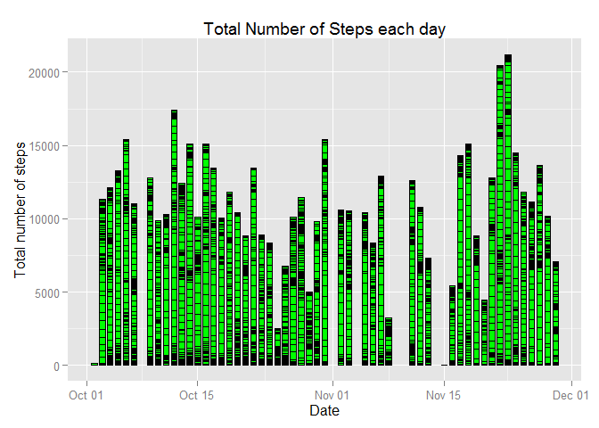
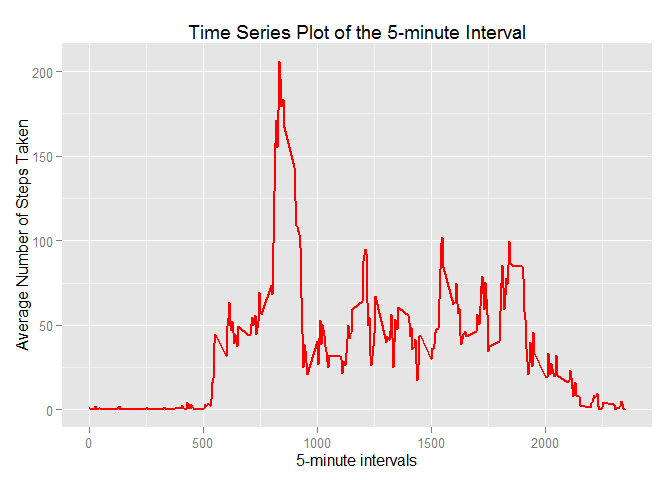
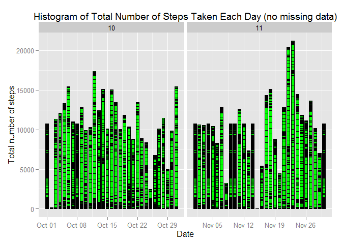
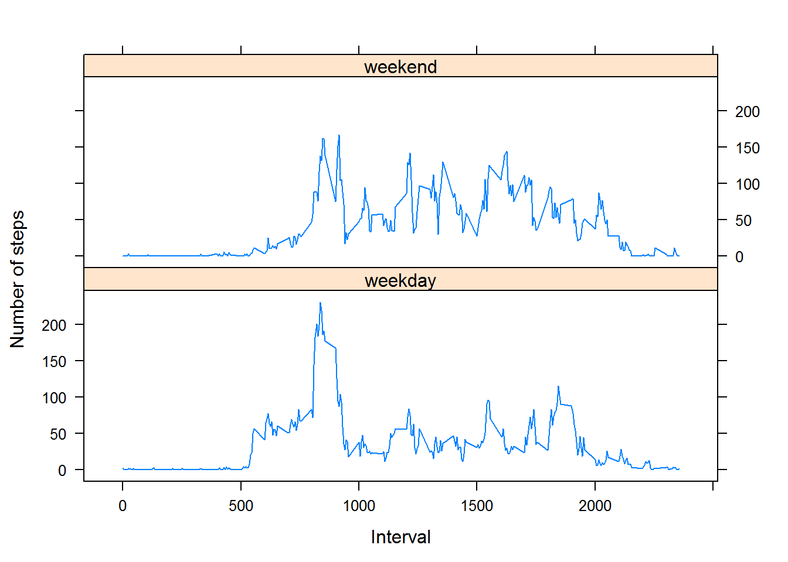

Peer Assessement 1
=========================

####Loading and preprocessing the data####
1. Load the data (i.e. read.csv())


```r
setwd("C:/Users/jobby/Documents/Personal/RepData_PeerAssessment1")
data <- read.csv("activity.csv", colClasses = c("integer", "Date", "factor"))
```

2. Process/transform the data (if necessary) into a format suitable for your analysis

```r
data$month <- as.numeric(format(data$date, "%m"))
newdata <- na.omit(data)
```

####What is mean total number of steps taken per day?####

1. Calculate the total number of steps taken per day

```r
TotalSteps <- aggregate(newdata$steps, list(Date = newdata$date), FUN = "sum")$x
```

2. Make a histogram of the total number of steps taken each day

```r
library(ggplot2)
```

```
## Warning: package 'ggplot2' was built under R version 3.2.1
```


```r
ggplot(newdata, aes(date, steps))+ geom_bar(stat = "identity", colour = "black", fill = "green", width = 0.7) + labs(title = "Total Number of Steps each day", x = "Date", y = "Total number of steps")
```

 


3. Calculate and report the mean and median of the total number of steps taken per day

```r
MeanTotalSteps<- mean(TotalSteps)

MedianTotalSteps<- median(TotalSteps)
```

Mean of total number of steps taken per day is 

```
## [1] 10766.19
```

Median of total number of steps taken per day is 

```
## [1] 10765
```


####What is the average daily activity pattern?####

1. Make a time series plot (i.e. type = "l") of the 5-minute interval (x-axis) and the average number of steps taken, averaged across all days (y-axis)

```r
Interval<- list(interval = as.numeric(as.character(newdata$interval)))
AverageSteps <- aggregate(newdata$steps, Interval, FUN = "mean")
```

2. Which 5-minute interval, on average across all the days in the dataset, contains the maximum number of steps?


```r
ggplot(AverageSteps, aes(interval, x)) + geom_line(color = "red", size = 0.8) + labs(title = "Time Series Plot of the 5-minute Interval", x = "5-minute intervals", y = "Average Number of Steps Taken")
```

 

The 5-minute interval that contains the maximum number of steps is 

```r
MaxSteps <- AverageSteps[AverageSteps$x == max(AverageSteps$x), ]
MaxSteps$interval
```

```
## [1] 835
```

####Imputing missing values####

1. Calculate and report the total number of missing values in the dataset
The total number of rows with NAs

```r
NArowsCount<- sum(is.na(data))
```

2. Devise a strategy for filling in all of the missing values in the dataset. 

Use the mean for that 5-minute interval to fill each NA value.

3. Create a new dataset that is equal to the original dataset but with the missing data filled in


```r
FilledinData <- data 
        for (i in 1:nrow(FilledinData)) {
                if (is.na(FilledinData$steps[i])) {
                FilledinData$steps[i] <- AverageSteps[which(FilledinData$interval[i] == AverageSteps$interval), ]$x
        }
}
```

Check if any "na" remains


```r
sum(is.na(FilledinData))
```

```
## [1] 0
```
4. Make a histogram of the total number of steps taken each day and Calculate and report the mean and median total number of steps taken per day. Do these values differ from the estimates from the first part of the assignment? What is the impact of imputing missing data on the estimates of the total daily number of steps?


```r
ggplot(FilledinData, aes(date, steps)) + 
        geom_bar(stat = "identity",color = "black",fill = "green",width = 0.7) + 
        facet_grid(. ~ month, scales = "free") + 
        labs(title = "Histogram of Total Number of Steps Taken Each Day (no missing data)", 
             x = "Date", y = "Total number of steps")
```

 


```r
TotalStepsRevised <- aggregate(FilledinData$steps,list(Date = FilledinData$date), FUN = "sum")$x
```

Revised Mean of Total Steps

```r
MeanTotalStepsRevised <- mean(TotalStepsRevised)
```


```r
MeanTotalStepsRevised
```

```
## [1] 10766.19
```

Revised Median of Total Steps

```r
MedianTotalStepsRevised <- median(TotalStepsRevised)
MedianTotalStepsRevised
```

```
## [1] 10766.19
```


The mean of the total number of steps are different by 

```r
MeanTotalSteps - MeanTotalStepsRevised
```

```
## [1] 0
```

The median of the total number of steps are different by 

```r
MedianTotalSteps - MedianTotalStepsRevised
```

```
## [1] -1.188679
```

####Are there differences in activity patterns between weekdays and weekends?####

1. Create a new factor variable in the dataset with two levels - "weekday" and "weekend" indicating whether a given date is a weekday or weekend day.


```r
FilledinData$weekdays <- factor(format(FilledinData$date, "%A"))
levels(FilledinData$weekdays)
```

```
## [1] "Friday"    "Monday"    "Saturday"  "Sunday"    "Thursday"  "Tuesday"  
## [7] "Wednesday"
```

```r
levels(FilledinData$weekdays) <- list(weekday = c("Monday", "Tuesday",
                                             "Wednesday", 
                                             "Thursday", "Friday"),
                                 weekend = c("Saturday", "Sunday"))
table(FilledinData$weekdays)
```

```
## 
## weekday weekend 
##   12960    4608
```


```r
Interval <- list(interval = as.numeric(as.character(FilledinData$interval)),weekdays = FilledinData$weekdays)
AverageStepsRevised <- aggregate(FilledinData$steps, Interval, FUN = "mean")
```


2. Make a panel plot containing a time series plot (i.e. type = "l") of the 5-minute interval (x-axis) and the average number of steps taken, averaged across all weekday days or weekend days (y-axis). See the README file in the GitHub repository to see an example of what this plot should look like using simulated data


```r
library(lattice)
xyplot(AverageStepsRevised$x ~ AverageStepsRevised$interval | AverageStepsRevised$weekdays, 
       layout = c(1, 2), type = "l", 
       xlab = "Interval", ylab = "Number of steps")
```

 

